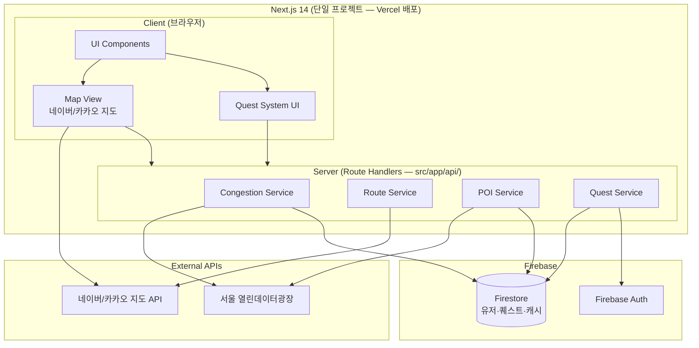

# StrangeMap — 마스터 플랜

## 1. Project Overview

StrangeMap은 서울시 빅데이터 경진대회 창업 부문 출품작으로, 매일 지옥철 출퇴근에 지친 서울 시민을 위한 스마트 우회 경로 추천 앱이다. 서울 열린데이터광장의 실시간 혼잡도 데이터를 기반으로 덜 붐비는 대안 경로를 추천하고, 경로 주변의 문화·행사·야경명소 등 몰랐던 정보를 함께 보여준다. 나아가 게임형 퀘스트 시스템을 통해 단순 이동을 탐험으로 바꾸는 경험을 제공한다.

---

## 2. Goals

### 경진대회 MVP 목표
- [ ] 서울 열린데이터 API를 활용한 **실시간 혼잡도 시각화**가 지도 위에 동작
- [ ] 출발지/목적지 설정 → 혼잡 구간 감지 → **우회 경로 추천** 기능 완성
- [ ] 경로 주변 **문화/행사/야경명소** 오버레이 표시
- [ ] 게임형 **퀘스트 시스템** 프로토타입 (최소 1종 퀘스트 동작)
- [ ] 경진대회 시연 가능한 수준의 **완성도 있는 UI/UX**
- [ ] 서울시 빅데이터를 **창의적으로 조합**했다는 점이 드러나는 발표 자료

### 기술 목표
- Next.js Route Handlers로 프론트/백 통합 (단일 프로젝트, Vercel 배포 최적화)
- 외부 API 의존을 추상화하여 데이터 소스 교체 용이
- 카테고리 확장이 쉬운 플러그인형 POI(Point of Interest) 구조

---

## 3. Architecture



**데이터 흐름 요약:**
1. 사용자가 지도에서 출발지/목적지 선택
2. Frontend → Backend로 경로 요청
3. Backend가 서울 열린데이터 API에서 혼잡도 조회 (캐시 우선)
4. 혼잡 구간을 피하는 우회 경로 계산
5. 경로 반경 내 POI(문화/행사/야경) 조회
6. 결과를 Frontend로 반환 → 지도 위에 시각화

---

## 4. Phase별 구현 계획

### Phase 0 — 프로젝트 셋업 (Day 1~2)
- [ ] Next.js 14 + TypeScript + Tailwind 단일 프로젝트 초기화
- [ ] Firebase 프로젝트 생성 및 Firestore, Auth 활성화
- [ ] Firebase SDK 연동 (`firebase/app`, `firebase/auth`, `firebase/firestore`)
- [ ] ESLint + Prettier 설정
- [ ] 환경변수 관리 (`.env.local` + `.env.example`, Vercel 대시보드 등록)
- [ ] 서울 열린데이터광장 API 인증키 발급 및 Route Handler에서 연동 테스트
- [ ] 지도 API 선택 및 API 키 발급
- [ ] 기본 지도 렌더링 확인 (Hello Map)
- [ ] Vercel 프로젝트 연결 및 첫 배포 확인

### Phase 1 — 혼잡도 기반 우회 경로 (Day 3~7)
- [ ] **Backend: 혼잡도 데이터 수집**
  - [ ] 서울 실시간 도시데이터 API 연동 (`citydata`)
  - [ ] 지하철 혼잡도 API 연동
  - [ ] 혼잡도 데이터 정규화 (1~5단계 스케일)
  - [ ] 캐시 레이어 구현 (5분 TTL)
- [ ] **Backend: 경로 계산**
  - [ ] 지도 API 길찾기 연동 (도보/대중교통)
  - [ ] 혼잡도 가중치 기반 경로 스코어링 알고리즘
  - [ ] 대안 경로 최대 3개 반환
- [ ] **Frontend: 지도 UI**
  - [ ] 출발지/목적지 마커 설정 (클릭 or 검색)
  - [ ] 주소/장소 검색 기능
  - [ ] 혼잡도 히트맵 오버레이 (색상 그라데이션)
  - [ ] 경로 폴리라인 렌더링 (혼잡도별 색상)
  - [ ] 경로 비교 패널 (소요시간, 혼잡도 점수)

### Phase 2 — 경로 내 주변 정보 추천 (Day 8~11)
- [ ] **Backend: POI 데이터**
  - [ ] 문화행사 API 연동 (`culturalEventInfo`)
  - [ ] 야경명소 API 연동
  - [ ] POI 카테고리 통합 인터페이스 설계 (플러그인 패턴)
  - [ ] 경로 반경 필터링 로직 (경로 버퍼 영역 내 POI 추출)
- [ ] **Frontend: POI 오버레이**
  - [ ] 카테고리별 마커 아이콘 디자인
  - [ ] 카테고리 필터 토글 UI
  - [ ] POI 클릭 시 상세 카드 팝업
  - [ ] 우회 시 추가 소요시간 표시
  - [ ] "경로에 추가" 버튼 → 경로 재계산

### Phase 3 — 게임형 퀘스트 시스템 (Day 12~16)
- [ ] **Backend: 퀘스트 엔진**
  - [ ] 퀘스트 템플릿 정의 (JSON Schema)
  - [ ] 경로/거리 기반 퀘스트 자동 생성 로직
  - [ ] 퀘스트 진행 상태 관리 API
  - [ ] 보상 시스템 (뱃지, 경험치, 레벨)
- [ ] **Frontend: 퀘스트 UI**
  - [ ] 퀘스트 카드 컴포넌트 (게임 스타일)
  - [ ] 활성 퀘스트 목록 사이드 패널
  - [ ] 퀘스트 진행률 표시 (프로그레스 바)
  - [ ] 퀘스트 완료 애니메이션/팝업
  - [ ] 뱃지 컬렉션 페이지

### Phase 4 — 마무리 및 발표 준비 (Day 17~20)
- [ ] 전체 플로우 통합 테스트
- [ ] UI/UX 폴리싱 (반응형, 로딩 상태, 에러 처리)
- [ ] 시연용 데모 시나리오 준비
- [ ] 발표 자료 작성
- [ ] README 및 문서 정리

---

## 5. Directory Structure

```
strangemap/
├── package.json
├── tsconfig.json
├── tailwind.config.ts
├── next.config.js
├── .env.local
├── .env.example
├── plan.md
├── CLAUDE.md
├── public/
│   └── icons/                    # 마커 아이콘, 뱃지 이미지
└── src/
    ├── app/
    │   ├── layout.tsx
    │   ├── page.tsx               # 메인 지도 페이지
    │   ├── quest/
    │   │   └── page.tsx           # 퀘스트 목록/뱃지 페이지
    │   └── api/                   # Route Handlers (서버 역할)
    │       ├── congestion/
    │       │   └── route.ts
    │       ├── route/
    │       │   └── route.ts
    │       ├── poi/
    │       │   └── route.ts
    │       └── quest/
    │           └── route.ts
    ├── components/
    │   ├── map/
    │   │   ├── MapView.tsx
    │   │   ├── RouteOverlay.tsx
    │   │   ├── CongestionHeatmap.tsx
    │   │   └── POIMarker.tsx
    │   ├── route/
    │   │   ├── SearchBar.tsx
    │   │   ├── RouteCompare.tsx
    │   │   └── RouteCard.tsx
    │   ├── poi/
    │   │   ├── POICard.tsx
    │   │   └── CategoryFilter.tsx
    │   └── quest/
    │       ├── QuestCard.tsx
    │       ├── QuestPanel.tsx
    │       └── BadgeCollection.tsx
    ├── services/                  # Route Handlers에서 호출하는 서버 로직
    │   ├── congestion.service.ts
    │   ├── route.service.ts
    │   ├── poi.service.ts
    │   └── quest.service.ts
    ├── providers/                 # 외부 API 추상화
    │   ├── seoul-api.provider.ts
    │   └── map-api.provider.ts
    ├── lib/
    │   ├── firebase.ts            # Firebase 초기화
    │   ├── firestore.ts           # Firestore 헬퍼
    │   └── mapUtils.ts            # 좌표 변환, 거리 계산
    ├── hooks/
    │   ├── useMap.ts
    │   ├── useCongestion.ts
    │   └── useQuest.ts
    ├── store/                     # Zustand 전역 상태
    │   ├── mapStore.ts
    │   ├── questStore.ts
    │   └── uiStore.ts
    └── types/
        ├── congestion.ts
        ├── route.ts
        ├── poi.ts
        └── quest.ts
```

---

## 6. API Design

### 혼잡도 (Congestion)

| Method | Endpoint | 설명 |
|--------|----------|------|
| `GET` | `/api/congestion` | 전체 혼잡도 현황 (히트맵용) |
| `GET` | `/api/congestion/:areaId` | 특정 지역 상세 혼잡도 |
| `GET` | `/api/congestion/route` | 경로 상 혼잡도 조회 (`?waypoints=lat,lng\|lat,lng`) |

### 경로 (Route)

| Method | Endpoint | 설명 |
|--------|----------|------|
| `POST` | `/api/route/search` | 우회 경로 탐색 |
| `POST` | `/api/route/compare` | 일반 경로 vs 우회 경로 비교 |

```typescript
// POST /api/route/search Request Body
{
  origin: { lat: number; lng: number };
  destination: { lat: number; lng: number };
  mode: "transit" | "walk";
  avoidCongestion: boolean;  // true면 혼잡 구간 우회
}

// Response
{
  routes: Array<{
    id: string;
    polyline: Array<{ lat: number; lng: number }>;
    duration: number;          // 분
    distance: number;          // 미터
    congestionScore: number;   // 1~5 (낮을수록 쾌적)
    congestionSegments: Array<{
      start: { lat: number; lng: number };
      end: { lat: number; lng: number };
      level: 1 | 2 | 3 | 4 | 5;
    }>;
  }>;
}
```

### POI (주변 정보)

| Method | Endpoint | 설명 |
|--------|----------|------|
| `GET` | `/api/poi` | 경로 주변 POI 조회 (`?routeId=&category=&radius=`) |
| `GET` | `/api/poi/:id` | POI 상세 정보 |
| `GET` | `/api/poi/categories` | 사용 가능한 카테고리 목록 |

```typescript
// GET /api/poi Response
{
  pois: Array<{
    id: string;
    name: string;
    category: "culture" | "event" | "nightview" | string;
    location: { lat: number; lng: number };
    description: string;
    thumbnail?: string;
    detourMinutes: number;  // 우회 시 추가 소요시간
  }>;
}
```

### 퀘스트 (Quest)

| Method | Endpoint | 설명 |
|--------|----------|------|
| `POST` | `/api/quest/generate` | 경로 기반 퀘스트 자동 생성 |
| `GET` | `/api/quest/active` | 현재 활성 퀘스트 목록 |
| `PATCH` | `/api/quest/:id/progress` | 퀘스트 진행 상태 업데이트 |
| `POST` | `/api/quest/:id/complete` | 퀘스트 완료 처리 |
| `GET` | `/api/quest/badges` | 획득한 뱃지 목록 |

```typescript
// POST /api/quest/generate Request Body
{
  routeId: string;
  origin: { lat: number; lng: number };
  destination: { lat: number; lng: number };
}

// Response
{
  quests: Array<{
    id: string;
    title: string;
    description: string;
    type: "visit" | "explore" | "collect";
    objectives: Array<{
      id: string;
      description: string;
      targetPOI?: string;
      completed: boolean;
    }>;
    reward: {
      xp: number;
      badge?: { id: string; name: string; icon: string };
    };
  }>;
}
```

---

## 7. Data Sources

서울 열린데이터광장 API는 **Route Handlers(서버)에서만 호출** — API 키 클라이언트 노출 없음.

서울 열린데이터광장 (https://data.seoul.go.kr/) 활용 API:

| API 이름 | 엔드포인트 | 용도 | Phase |
|----------|-----------|------|-------|
| 서울시 실시간 도시데이터 | `citydata` | 주요 장소별 실시간 인구 혼잡도 | 1 |
| 서울시 지하철 실시간 혼잡도 | `subwayRealTimePosition` / 혼잡도 관련 | 지하철 노선별 칸별 혼잡도 | 1 |
| 서울시 문화행사 정보 | `culturalEventInfo` | 경로 주변 문화/전시/공연 정보 | 2 |
| 서울시 야경명소 | 야경 관련 데이터셋 | 야경 포인트 좌표 및 설명 | 2 |
| 서울시 관광명소 | 관광 관련 데이터셋 | 추가 POI 소스 (카테고리 확장) | 2+ |

**데이터 갱신 전략 (Firestore 캐시):**
- 혼잡도 데이터: 5분 간격 캐시 (실시간성 유지)
- 문화행사 데이터: 1시간 간격 캐시 (비교적 정적)
- 야경명소 데이터: 1일 간격 캐시 (거의 변동 없음)

**주의사항:**
- 서울 열린데이터광장 API 일일 호출 제한 → Firestore 캐시 필수
- Firestore 무료 플랜 한도: 읽기 50,000/일, 쓰기 20,000/일 (MVP 시연 수준은 충분)
- Vercel 서버리스 함수 타임아웃 기본 10초 → 캐시 히트 우선, API 호출은 최소화
- 인증키는 `.env.local`로 관리, Vercel 대시보드 환경변수에 등록, 절대 커밋 금지

---

## 8. Open Questions

| # | 질문 | 선택지 | 결정 기한 | 메모 |
|---|------|--------|----------|------|
| 1 | **지도 API 선택** | 네이버 지도 vs 카카오 맵 | Phase 0 | 카카오: 문서 친화적, 무료 쿼터 넉넉 / 네이버: 길찾기 API 품질 우수 |
| 2 | **인증/유저 관리** | ~~로컬 저장 vs 간단 로그인 vs 없음~~ → **Firebase Auth 결정** | — | ✅ 해결 |
| 3 | **DB 선택** | ~~SQLite vs PostgreSQL~~ → **Firebase Firestore 결정** | — | ✅ 해결 |
| 4 | **배포 환경** | ~~Vercel + Railway vs 로컬 시연~~ → **Vercel 단일 배포 결정** | — | ✅ 해결 |
| 5 | **지하철 혼잡도 데이터 범위** | 실시간만 vs 예측(시간대별 평균) 포함 | Phase 1 | 예측 데이터가 있으면 "출발 시간 추천" 기능 가능 |
| 6 | **경로 계산 방식** | 지도 API 길찾기 그대로 vs 자체 가중치 그래프 | Phase 1 | 지도 API 결과에 혼잡도 가중치만 적용하는 하이브리드 방식 유력 |
| 7 | **모바일 대응** | 반응형 웹 vs PWA vs 웹뷰 앱 | Phase 4 | 시연 디바이스에 따라 결정. 우선 반응형 웹으로 개발 |
